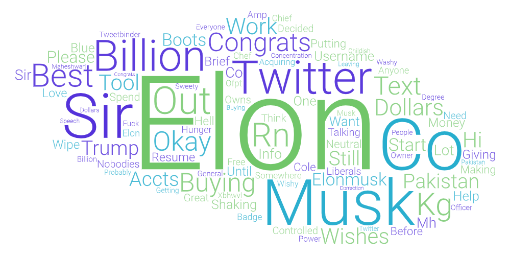
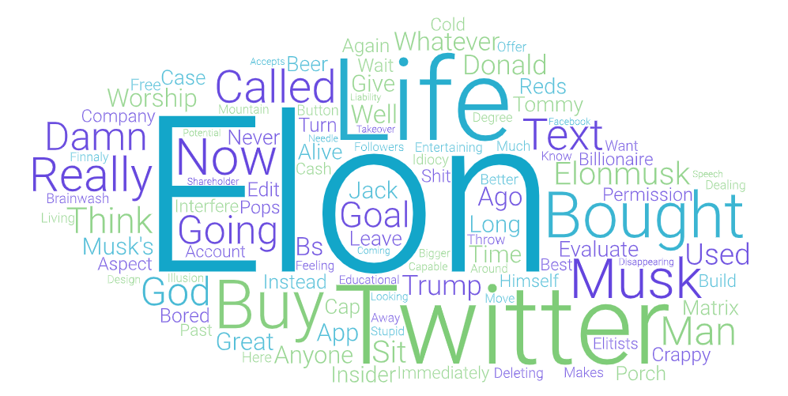
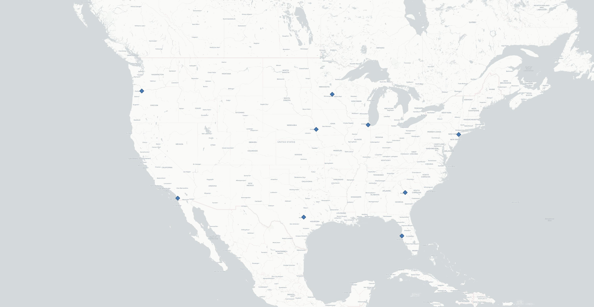

Geo-tagged tweet collection and visualization

Elon Musk recently purchased Twitter. With the big news, I decided to do use a keyword search of "Elon" to analyze tweet text, location, and time. I collected Geo-tagged Twitter data using an API-based crawler and visualized them using QGIS and WordArt.com. I did one Elon search at 3pm on 4/25/22 and another one at 4pm on the same day. I chose these two time periods to compare tweets closer to the common work day and tweets further from the common work day. I consider 9am-5pm as the common work day for Americans. I did both analysis on the same region, the lower 48 states in the United States.  

"Elon" keyword twitter search at 3pm 4/25/22 Word Cloud:

 
"Elon" keyword twitter search at 4pm 4/25/22 Word Cloud:

Obviously Elon is the most frequent word in both word clouds. Twitter is also a frequent word. For my 3pm word cloud, Sir, was a common word. I have no idea why that word showed up a lot. Most of the words that showed up frequently were positive. Common words were: congrats, best, and great. The word clouds are different because the 3pm map had a higher concentration of words. The 4pm word cloud had a diverse set of words. 

"Elon" keyword twitter search at 3pm 4/25/22 Map:

"Elon" keyword twitter search at 4pm 4/25/22 Map:

I noticed that there were more "Elon" tweets in the 4pm map than the 3pm map. That could be because 3pm is closer to the common work day. There are less people at work during 4pm so that can be a cause for an increase in "Elon" tweets. Keep in mind that I ran my crawler for 500 seconds on both datasets.
